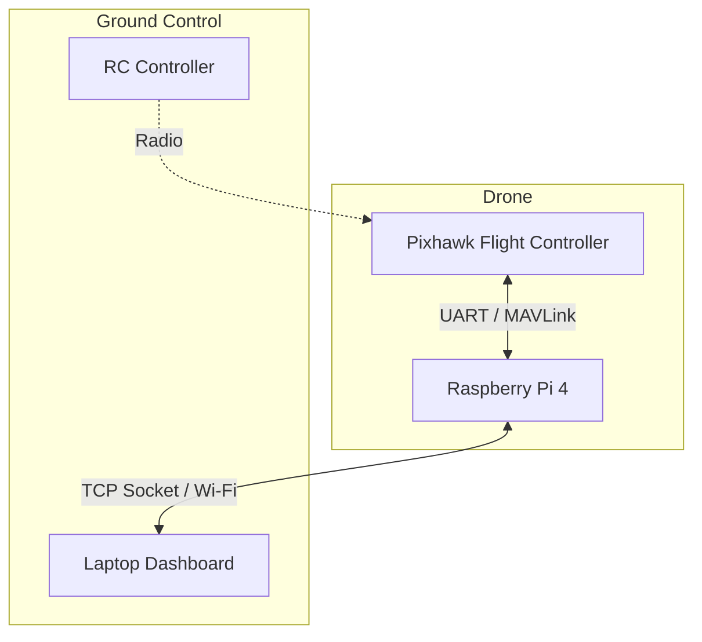

# 🏗️ Project Architecture

The system uses a distributed approach, splitting tasks between an onboard **[[RPI Drone Bridge]]** and a **[[Laptop GCS (Ground Control Station)]]**.

## Data Flow
1. User provides a command via the **[[Laptop GCS (Ground Control Station)]]** (Voice or UI).
2. The laptop sends the command over a TCP Socket (typically Port 5760 or 5000) to the **[[RPI Drone Bridge]]**.
3. The RPI translates TCP packets into MAVLink and sends them to the Pixhawk via UART.
4. Telemetry is sent back continuously from the Pixhawk -> RPI -> Laptop.
